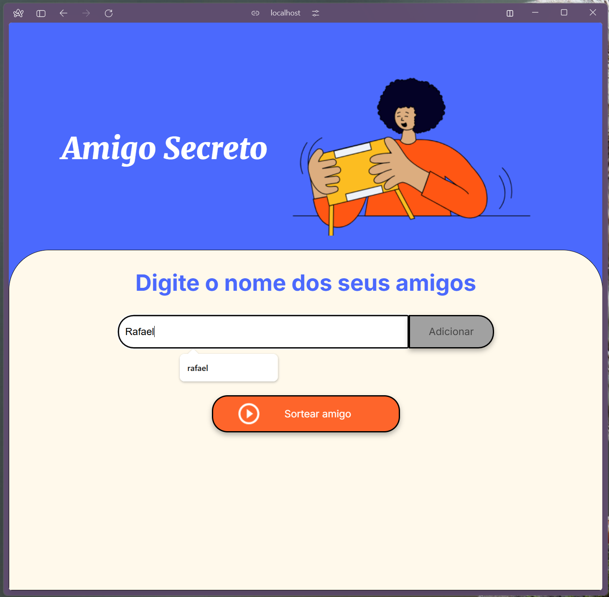
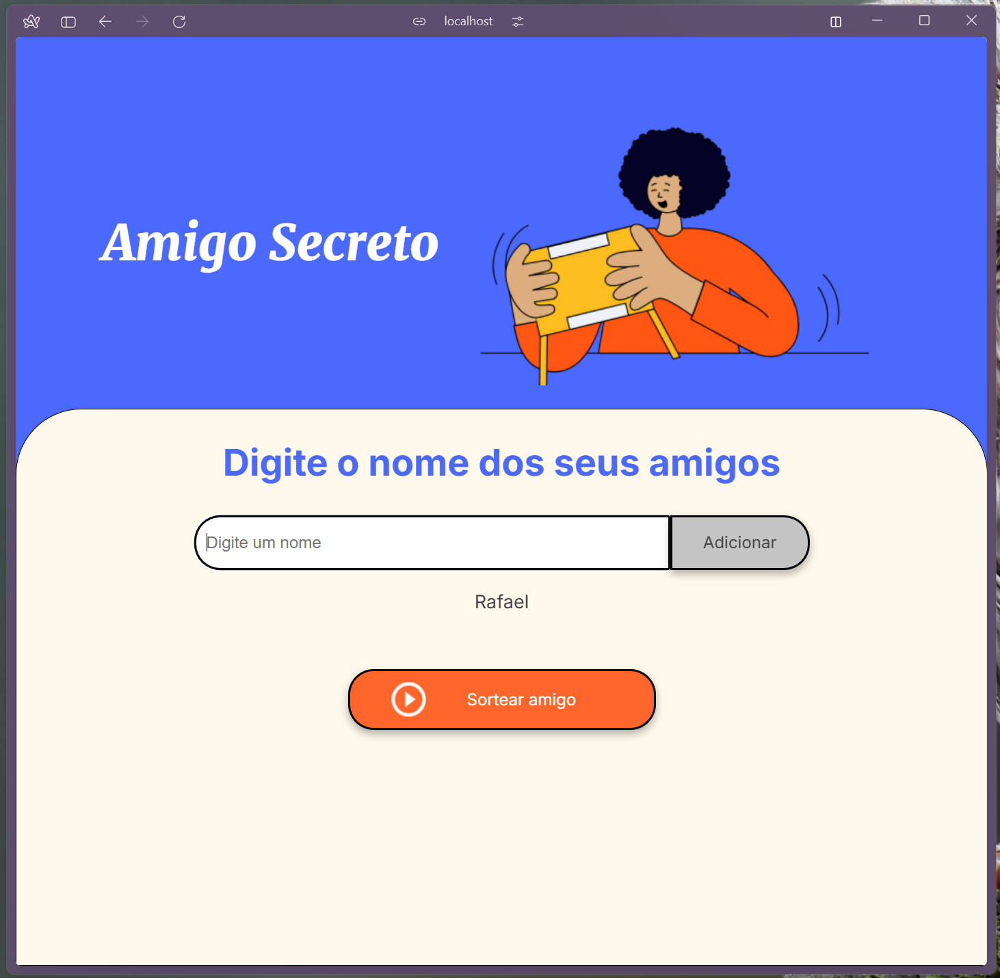
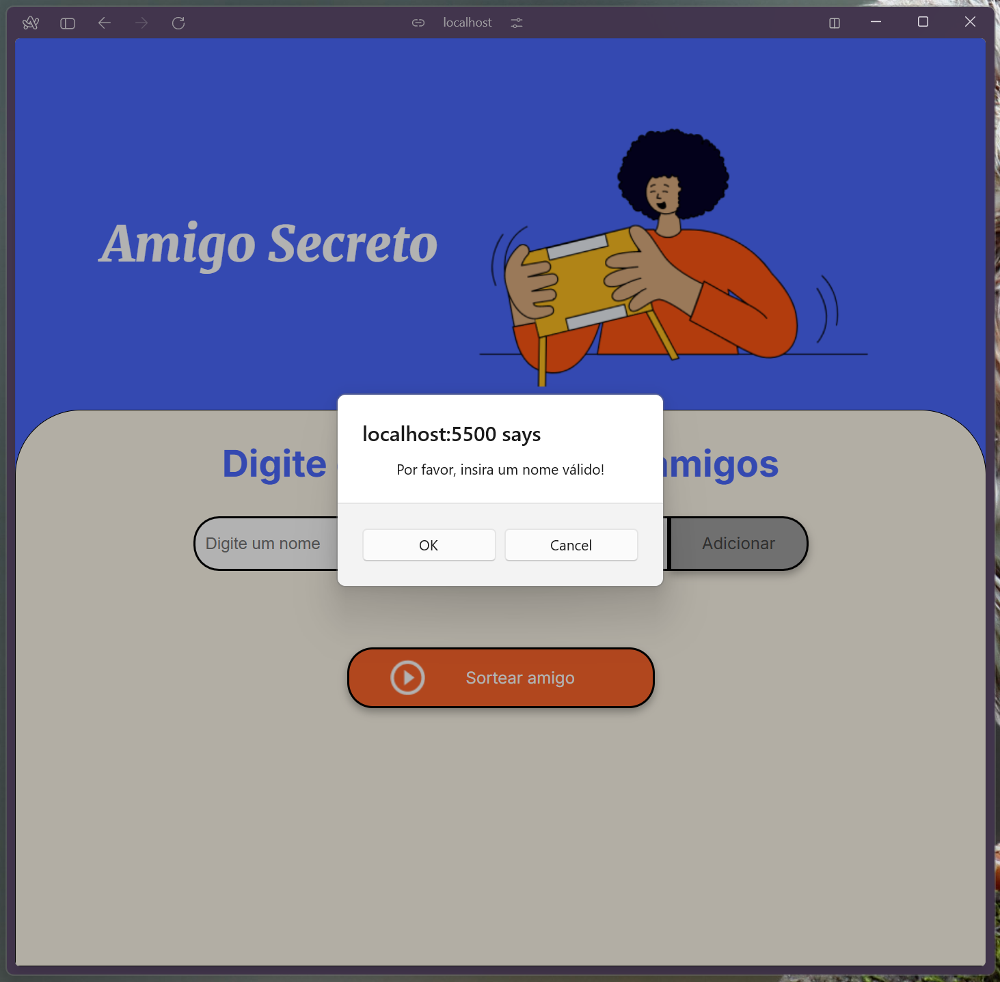
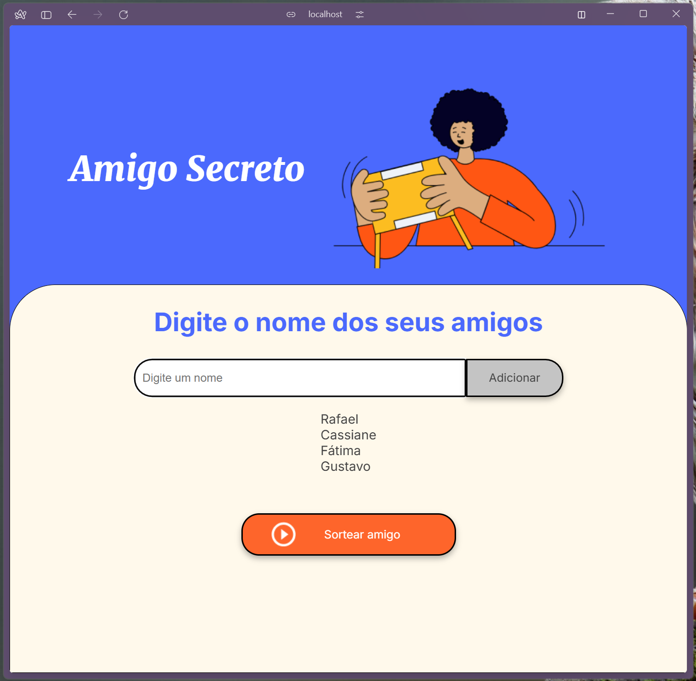
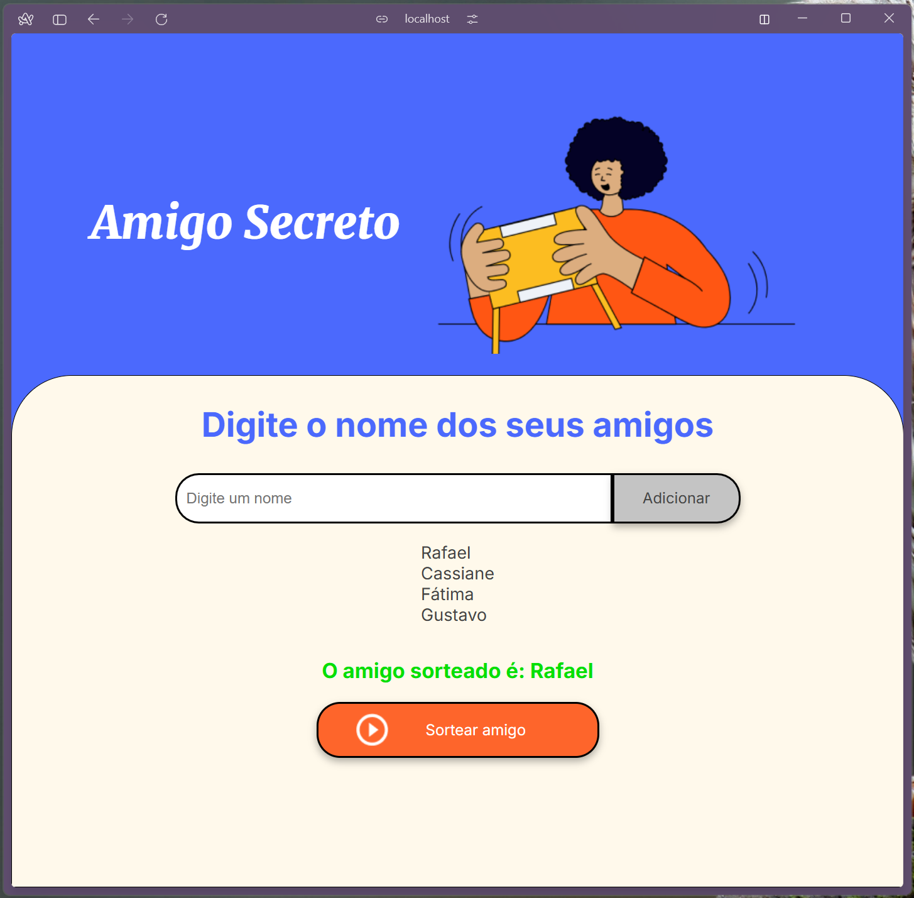

# 🎉 Praticando Lógica de Programação: Challenge Amigo Secreto

Este projeto foi desenvolvido para consolidar os conhecimentos adquiridos nos cursos da formação **One Oracle Next Education**, uma parceria entre **Oracle** e **Alura**:

- **Lógica de programação: mergulhe em programação com JavaScript**
- **Lógica de programação: explore funções e listas**
- **Git e GitHub: compartilhando e colaborando em projetos**
- **ChatGPT: otimizando a qualidade dos resultados**

🔹 **Tecnologias utilizadas:** JavaScript, HTML e CSS _(somente o JavaScript foi implementado por mim)_.

---

## 📌 Descrição do Desafio

Neste desafio, desenvolvi uma aplicação que permite aos usuários inserir nomes de amigos em uma lista para, em seguida, realizar um sorteio aleatório e determinar quem é o "amigo secreto".

🔹 **Funcionalidades principais:**

1. O usuário adiciona nomes por meio de um campo de texto e um botão "Adicionar".
2. Os nomes inseridos aparecem em uma lista visível na página.
3. O usuário pode clicar no botão "Sortear Amigo" para selecionar um nome aleatório.
4. Caso o campo de entrada esteja vazio, um alerta solicitará um nome válido.

---

## 🚀 Funcionalidades Implementadas

### ✅ Adicionar nomes

Os usuários podem inserir nomes de amigos no campo de texto e adicioná-los à lista ao clicar no botão "Adicionar".

---

### ✅ Validar entrada

Se o campo de entrada estiver vazio, um alerta será exibido para solicitar um nome válido.

---

### ✅ Visualizar a lista

Os nomes adicionados aparecerão em uma lista visível na página.

---

### ✅ Sorteio aleatório

Ao clicar no botão "Sortear Amigo", um nome da lista será selecionado aleatoriamente e exibido na página.

---

## 💙 Agradecimentos

Quero expressar minha gratidão aos instrutores da **Alura** pelo excelente conteúdo e dedicação ao ensino, à **Oracle** pela oportunidade incrível de participar da formação **One Oracle Next Education**, e à comunidade no **Discord** da formação pelo apoio, troca de conhecimento e incentivo constante. Esse aprendizado só foi possível graças a essa rede de pessoas incríveis! 🚀🙏
